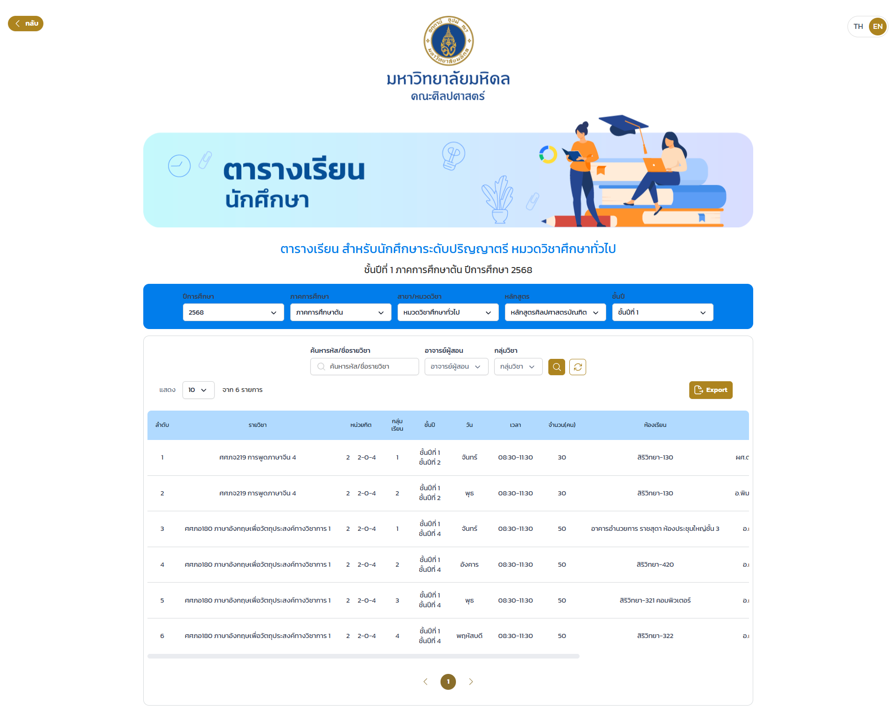

# Mula: Mahidol University Learning Assistant

A **centralized academic portal** for Mahidol University, built with Nuxt 3.  
The platform features a **comprehensive course catalog**, an **interactive GPA calculator**, and a **university news feed**, all designed to streamline the student experience with a clean and modern interface.

---

<p align="center">
  <a href="screenshots/sc1.png" target="_blank">
    
  </a>
  <a href="screenshots/sc2.png" target="_blank">
    
  </a>
</p>

---

## 🚀 Features

- **Course Catalog**: Browse and filter courses by faculty, level, or search terms
- **GPA Calculator**: Interactive tool for calculating and projecting academic performance
- **University News Feed**: Dedicated section for official announcements and updates
- **State Management**: Centralized state management for a seamless user experience using Pinia
- **Design System**: Reusable Vue 3 UI components
  - Header, Footer, Card, Button
  - Layout components, Form elements
- **Responsive UI** built with Tailwind CSS
- **Type-Safe Development** with TypeScript

---

## 🛠 Tech Stack

- **Framework:** Nuxt 3
- **UI Library:** Vue 3
- **Language:** TypeScript
- **State Management:** Pinia
- **Styling:** Tailwind CSS
- **Developer Tools:** ESLint

---

## ⚙️ Installation

1.  Clone the repository

    ```bash
    git clone https://github.com/nithasp/mula-mahidol.git
    cd mula-mahidol
    ```

2.  Install dependencies

    ```bash
    npm install
    ```

3.  Run the development server

    ```bash
    npm run dev
    ```

4.  Open your browser and navigate to [http://localhost:3000](http://localhost:3000)